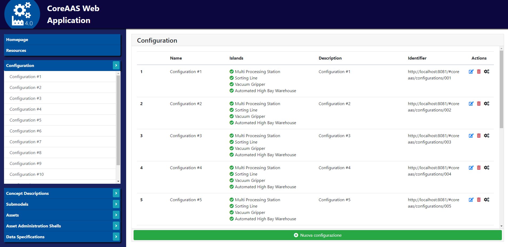

# CoreAAS-based-application
Master degree thesis project dealing with the development of an Asset Administration Shell of a Factory. This project aims to show a possible implementation of an AAS and the importance of adopting the PLC open standard (https://plcopen.org/) for the development of PLC projects in order to support the interoperability in the Industry 4.0.


## Table of Contents
- [References](#References)
- [Screenshots](#screenshots)
- [Requirements](#Requirements)
- [Dependencies](#Dependencies)
- [Running for test](#Running-for-test)
- [Future developments](#Future-developments)


## References
References available (italian only) at:
- docs/UML


## Screenshots
- **Web Application**



## Requirements
The application has the following requirements (needed to run the project)
Note: this app was successfully tested on Windows 10. The following links refer to Windows 10. If using a different Operative System, it is necessary to search and download the proper software. 
- **OPC UA CoreAAS based Server**:
	1. NodeJS (https://nodejs.org/it/)
	2. Typescript. Open a terminal and write:
		```
		npm install -g typescript
		```
	3. OPC UA CoreAAS Server and its dependencies. Open a terminal and write (from the root folder of the project):
		```
		cd aas_opcuaserver
		npm install 
		```
	> Note: don't run "npm update" command or dependencies will be updated and the opcuaserver may not compile anymore!
- **Web Application**:
	1. Nodejs.
	2. Package-json. Open a terminal and write:
		```
		cd aas_webapp
		npm install
		```
	3. Http-server. Open a terminal and write:
		```
		npm install -g http-server
		```
- **Nodejs Server**:
	1. Nodejs.
	2. Package-json. Open a terminal and write:
		```
		cd aas_nodeserver
		npm install
		```
	3. MongoDB (https://www.mongodb.com/download-center/community)
	4. OpenPLC Runtime (https://www.openplcproject.com/runtime). 
		- Download and install the runtime environment from the above link.
		- Copy the file "webserver.py", "plcTemplate.st" from the folder "aas_nodeserver\rsc" to the folder "OpenPLC_v3\webserver" located in the OpenPLC runtime installation folder (e.g. C:\Users\Aless\OpenPLC\Runtime\home\Aless\OpenPLC_v3\webserver).


## Dependencies
The application has the following dependencies (libraries and packages)
- **OPC UA CoreAAS based Server**:
	1. node-opcua-coreaas https://github.com/OPCUAUniCT/node-opcua-coreaas.
- **Web Application**:
	1. AngularJS 1.7.9 https://angularjs.org/.
	2. AngularRoute 1.7.9.
	3. AngularSanitize 1.7.9.
	4. AngularAnimate 1.7.9.
	5. AngularToastr 2.1.1.
	6. Jquery 3.4.1.
	7. UiBootstrap 3.0.6.
	8. Bootstrap 4.3.1 https://getbootstrap.com/docs/4.0/getting-started/download/.
	9. FontAwesome 5.6.1 https://fontawesome.com/.
	10. ImageMapster 1.2.10 http://www.outsharked.com/imagemapster/.
	11. Http-server 0.12.0 (package-json).
- **Nodejs Server**:
	1. Body-parse 1.19.0 (package-json).
	2. Cors 2.8.5 (package-json).
	3. Mongodb 3.3.4 (package-json).
	4. Mongoose 5.7.12 (package-json).
	5. Express 4.17.1 (package-json).


## Running for test
After having installed all the requirements it is possible to clone this project and run it by following the next steps. 

#### 1. Clone the project from master branch
- Open a terminal and write:
	```
	git clone https://github.com/Taletex/CoreAAS-based-application
	```

#### 2. Build and run the OPC UA CoreAAS based Server
- Open a terminal and write (from the root folder of the project):
	```
	cd aas_opcuaserver
	npm run uaIndustryServer
	```

#### 3. Run the Web Application
- Http-server. Open a terminal and write (from the root folder of the project):
	```
	cd aas_webapp
	http-server -o -p 8081
	```
   A new browser tab at the address where the web application is running will open.

#### 4. Run the Nodejs Server, OpenPLC Runtime and MongoDB database
- MongoDB server. Execute the mongoDB server previously installed.
  > To enable MongoDB server to be addressed from any IP address (and not only from localhost) go to the installation folder, then bin. Open a terminal (using administrator priviledges) and write:
  	```
	mongod --dbpath ../data --bind_ip 0.0.0.0
	```
    This will run mongodb server and let it to accept connections from any IP address.
- OpenPLC Runtime setup. Execute the openPLC Runtime previously installed.
- NodeJs-server. Open a terminal and write (from the root folder of the project):
	```
	cd aas_nodeserver
	node server.js
	```
  > If you need to connect to a mongodb server hosted in another PC (different from the one hosting the nodejs server), you need to run the nodejs server with the follow command: 
  	```
	node server.js ip
	```
    where "ip" is the ip address of the PC hosting the mongodb server (default: "localhost")


## Future developments
The system created underlines the effectiveness of the solutions proposed by Plattform Industrie 4.0. The Asset Administration Shells perform the digitalization of the smart factory under consideration, allowing a user to interact at will through an OPC UA Client or a Web Browser.
The use of two technologies such as OPC UA and the Web to access the system improve the ability to use the system, while enabling the possibility of Machine To Machine (M2M) scenarios.
The work on interoperability, carried out as defined by PLCopen, thus adopting XML in the industrial sector, highlights how the use of open and standard formats for the realization of industrial projects represents a key element for the diffusion of Industry 4.0 solutions.
The implementation also illustrates the generalization possibilities of the project. One possible improvement concerns the standardization of the submodels of the Asset Administration Shells, relating to any island of a smart factory, highlighting the elements in common. It is also possible to generalize the smart factory configuration process, providing for a wider choice between additional production islands, which allows to consequently change the instances of the Asset Administration Shell considered. Similarly, a further development concerns the possibility of allowing a user to upload the XML file of his own program, which must be suitably modified by the system based on the chosen configuration, to guarantee its operation with the adopted smart factory.
